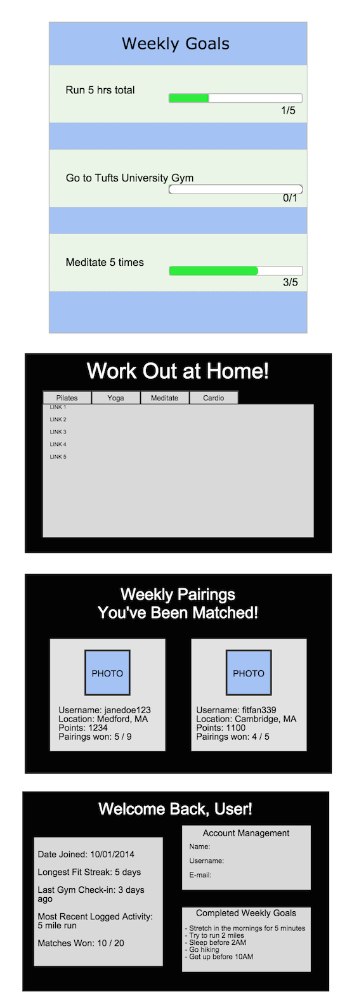

<h3>Healthy Habits</h3>

<h4>Problem Statement</h4>

Personal health and fitness covers a wide variety of areas. There is physical fitness and the much neglected mental health. 
How can you create an app to address both of these areas and inspire people to strive to be fit in both areas?

<h4>How to solve problem</h4>

To inspire people to strive for achievement in both physical and mental fitness, they need an incentive. Our incentive: points. People love earning points, and people love comparing their points to others and seeing their rank.

<h4>Earn points for</h4>
- Checking in at a registered gym location
- Taking a 10 minute mediation break
	- (choice of meditation songs that will loop for the 10 minutes)
- Yoga-ing, pilates-ing, stretching, meditating, and peaceful breathing along to some instructional YouTube videos we provide
- Make a list of goals for the week - personal, fitness, mental, etc.
- Checking off goals from the list

<h4>More incentive?</h4>
- Pair up two people each week who are at a similar level and match them against each other to get more points in a week
- Keep a counter and display after every workout to show people how much they've increased their life expectancy since using the app:
	- You gain seven hours of life expectancy for every hour of exercise
- Have a counter for total hours of exercise logged - earn points for getting a certain number of hours
- Maybe consider the possibility of a "points redemption system" through gym partnerships for further incentives if this expanded more

<h4>Features</h4>
	- Geolocation
	- Server-side data persistence
	- Front-end framework 
	- Reporting with charts and graphs
	- Send emails/SMSs/push notifications

<h4>Data</h4>
- User personal information: usernames, passwords, e-mails
- User app information: points, goals lists
- App things: YouTube video collection, meditation songs, gym check-in locations

<h4>Algorithms/techniques</h4>
- Algorithm to pair people will have to pair people within a certain range of points, randomly, and not repeat pairings too often
- Algorithm for calculating total workout/fitness hours
- Algorithm for calculating life expectancy: every gym session we measure how long they're there and every hour of exercise maps to seven hours of additional life expectancy

<h4>Mock-Ups</h4>

These mock-ups are sample features/pages our prototype will have.

#Comments by Ming
* Pretty good.  I like how you broke down the incentives.
* What front-end framework will you be using --and for what? That I am at a loss.
* What APIs will you be using?
